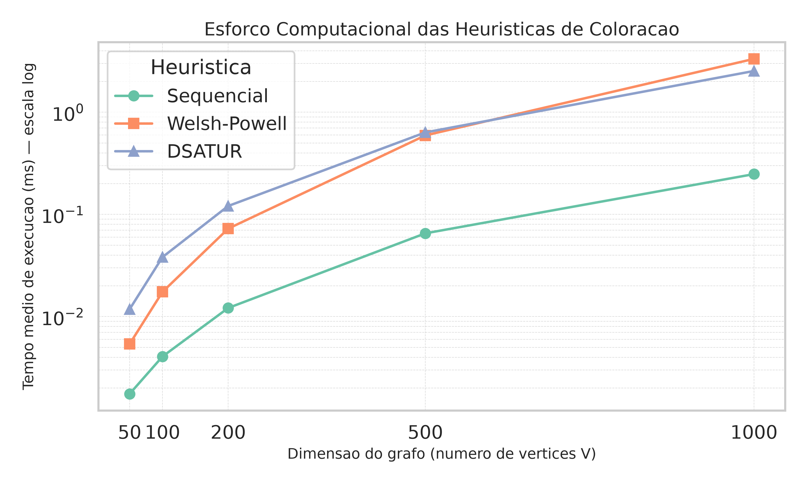
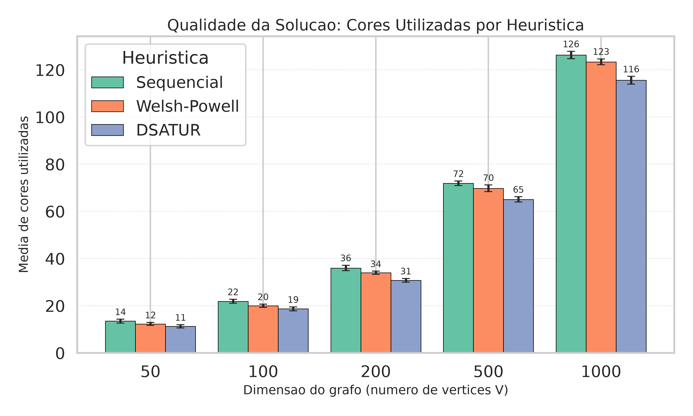

# Relatório — Coloração de Grafos: Análise Comparativa de Heurísticas

**Disciplina:** Teoria e Aplicação de Grafos
**Trabalho:** Coloração de Grafos — Heurísticas, Benchmark e Análise
**Aluno(s):** _[PREENCHER]_
**Professor(a):** _[PREENCHER]_
**Data:** _[PREENCHER]_

---

## Resumo

> _[PREENCHER — 1 parágrafo]_ Este trabalho implementa e compara três heurísticas
> clássicas de coloração de vértices — **Sequencial (Gulosa)**, **Welsh-Powell** e
> **DSATUR (Brélaz)** — sobre grafos aleatórios de dimensões crescentes
> (V = 50, 100, 200, 500, 1000). Avaliam-se duas métricas: o **esforço
> computacional** (tempo médio de execução) e a **qualidade da solução** (número
> médio de cores). _[Resumir aqui as principais conclusões após rodar o benchmark.]_

---

## 1. Introdução

A **coloração de grafos** consiste em atribuir rótulos ("cores") aos elementos de
um grafo sujeitos a restrições. Na **coloração de vértices** — foco deste
trabalho — nenhum par de vértices adjacentes pode compartilhar a mesma cor.

O **número cromático** χ(G) é o menor número de cores que torna possível uma
coloração própria de G. Embora o problema seja simples de enunciar, **determinar
χ(G) é NP-difícil** (Garey & Johnson, 1974), o que motiva o uso de **heurísticas**
de complexidade polinomial, capazes de fornecer boas soluções (não
necessariamente ótimas) em tempo viável.

**Objetivo:** comparar empiricamente três heurísticas quanto ao tempo de execução
e ao número de cores produzidas, em instâncias de tamanho crescente.

---

## 2. Fundamentação Teórica

### 2.1 Coloração de vértices e número cromático

- **Coloração própria:** atribuição de cores aos vértices tal que vértices
  adjacentes recebam cores distintas.
- **Número cromático χ(G):** menor quantidade de cores em uma coloração própria.
  Se uma coloração usa exatamente χ(G) cores, ela é dita **ótima**.
- O processo é sempre possível: um grafo com n vértices pode, no limite, usar n
  cores (uma por vértice).

### 2.2 Limitantes para χ(G)

- **Coloração sequencial:** χ(G) ≤ Δ(G) + 1, onde Δ(G) é o grau máximo. Justifica-se
  porque, ao colorir um vértice v, seus vizinhos já coloridos usam no máximo Δ
  cores, deixando sempre ao menos uma das cores 1..Δ+1 disponível.
- **Teorema de Brooks (1941):** se G é conexo, não é um ciclo ímpar e nem um grafo
  completo, então χ(G) ≤ Δ(G).
- **Clique:** χ(G) ≥ ω(G), onde ω(G) é o tamanho do maior clique. Um clique de
  tamanho q exige pelo menos q cores.
- **Conjunto independente:** χ(G) ≥ n / α(G), onde α(G) é o tamanho do maior
  conjunto independente.

### 2.3 Complexidade

- Determinar χ(G) é **NP-difícil** (Garey & Johnson, 1974).
- Métodos **exatos** (força bruta O(kⁿ), programação dinâmica O(2,445ⁿ), branch
  and bound) têm custo exponencial — inviáveis para instâncias grandes.
- Métodos **heurísticos** têm complexidade **polinomial** e são o foco deste
  trabalho.

---

## 3. Heurísticas Implementadas

### 3.1 Heurística Sequencial (Gulosa)

Percorre os vértices em uma ordem fixa e atribui a cada vértice o **menor inteiro
(cor)** ainda não usado por seus vizinhos já coloridos.

```
para cada vertice v em 0..n-1:
    marca as cores usadas pelos vizinhos ja coloridos de v
    color[v] <- menor cor nao marcada
```

- **Complexidade:** O(V + E).
- **Observação:** o resultado depende da ordem dos vértices; ordens diferentes
  produzem colorações diferentes. Garante χ(G) ≤ Δ + 1.

### 3.2 Algoritmo de Welsh-Powell

Prioriza vértices de **alto grau**, que tendem a ser mais difíceis de colorir.

```
1. calcule o grau de cada vertice
2. ordene os vertices em ordem DECRESCENTE de grau
3. para a cor corrente c:
      percorra a lista e atribua c a todo vertice ainda sem cor
      que NAO seja adjacente a nenhum vertice ja pintado com c
4. incremente c e repita ate todos coloridos
```

- **Complexidade:** O(V² ) no pior caso (varredura por cor).
- **Observação:** costuma usar menos cores que a sequencial pura.

### 3.3 Algoritmo DSATUR (Brélaz, 1979)

Constrói a ordem de coloração **dinamicamente**, usando o **grau de saturação** de
um vértice = número de cores distintas presentes em sua vizinhança.

```
1. ordene (conceitualmente) por grau; atribua a cor 1 ao vertice de maior grau
2. repita ate todos coloridos:
      selecione o vertice nao colorido de MAIOR grau de saturacao
          (desempate pelo maior grau no subgrafo ainda nao colorido)
      atribua-lhe a MENOR cor disponivel
      atualize a saturacao dos vizinhos
```

- **Complexidade:** O(V²) na implementação direta.
- **Observação:** em geral entrega as **melhores** soluções entre as três
  heurísticas; é ótima para grafos bipartidos e ciclos.

---

## 4. Aplicações Práticas

> Casos extraídos e resumidos dos slides da disciplina. Em todos, o **número
> cromático** representa a quantidade mínima de recursos (galpões, frequências,
> horários, registradores, fases, aquários etc.).

### 4.1 Separação de produtos explosivos

Uma indústria química precisa armazenar reagentes em estoque. Por **segurança**,
alguns pares de reagentes não podem ficar no mesmo galpão. **Modelagem:** cada
reagente é um **vértice**; reagentes **incompatíveis** definem as **arestas**;
cada **galpão** é uma **cor**. O **número cromático** indica o **número mínimo de
galpões** para armazenar todos os reagentes com segurança.

### 4.2 Atribuição de frequências de rádio

Os **vértices** representam os transmissores das estações de rádio. Duas estações
são **adjacentes** quando suas áreas de transmissão se **sobrepõem** — o que
causaria interferência se usassem a mesma frequência. Cada **cor** agrupa estações
que **podem receber a mesma frequência**. χ(G) é o **número mínimo de frequências**.

### 4.3 Agendamento de provas na universidade

Deseja-se agendar os exames de modo que duas disciplinas com **estudantes em
comum** não tenham provas no **mesmo horário**. **Modelagem:** disciplinas são
**vértices**; há **aresta** entre disciplinas que compartilham estudantes; cada
**horário** é uma **cor**. χ(G) fornece o **número mínimo de horários** necessários.

### 4.4 Alocação de registradores

Em um laço de programa, várias variáveis estão ativas simultaneamente. O compilador
constrói um **grafo de interferência** em que os **vértices** são os registradores
simbólicos e há **aresta** entre dois vértices se eles são **usados ao mesmo
tempo**. Cada **registrador físico** é uma **cor**. χ(G) é o **número mínimo de
registradores** necessários para evitar o problema de *overswapping*.

### 4.5 Sudoku

O Sudoku é uma **variação da coloração de vértices**. Cada uma das 81 **células** é
um **vértice**; existe **aresta** entre duas células que estão na **mesma linha**,
**mesma coluna** ou no **mesmo bloco 3×3**. Os números 1..9 são as **9 cores**.
Resolver o Sudoku equivale a completar uma coloração própria com 9 cores; como o
grafo contém **cliques de 9 vértices**, toda coloração válida precisa de **pelo
menos 9 cores**.

### 4.6 Semáforos

Em um cruzamento de duas ruas há **oito pistas de tráfego**. Durante cada **fase**
do semáforo, apenas os carros das pistas com luz verde prosseguem com segurança.
**Modelagem:** cada **pista** é um **vértice**; há **aresta** entre pistas cujos
fluxos **conflitam** (se cruzam); cada **fase** é uma **cor**. χ(G) é o **número
mínimo de fases** para que todos os carros eventualmente atravessem o cruzamento.

### 4.7 Designação de peixes em aquários

O dono de uma loja comprou peixes ornamentais de diversas espécies (um exemplar de
cada). Alguns peixes **não podem** coabitar o mesmo aquário, conforme uma tabela de
compatibilidade. **Modelagem:** cada **espécie** {A, B, …, I} é um **vértice**;
dois vértices são ligados por **aresta** sempre que as espécies **não podem** ficar
no mesmo aquário. Cada **aquário** é uma **cor**. χ(G) é o **número mínimo de
aquários** para acomodar todos os peixes sem incompatibilidade.

---

## 5. Metodologia Experimental

### 5.1 Geração dos grafos

- Grafos **não-orientados**, **não-completos** e **conexos**, em **lista de
  adjacências**.
- **Conexidade garantida** por uma árvore geradora aleatória (n−1 arestas
  iniciais); arestas adicionais inseridas pelo modelo **Erdős–Rényi G(n, p)**.
- **Densidade-alvo:** p = **0,5** (fixa para todas as dimensões).
- **Reprodutibilidade:** gerador Mersenne Twister (`std::mt19937`) com semente
  derivada por instância (`seed = base + V·100 + i`).

### 5.2 Ambiente e medição

- **Linguagem:** C++17 | **Build:** CMake (Release, `-O2`).
- **Tempo:** `std::chrono::high_resolution_clock`, medindo **apenas** o algoritmo
  de coloração (exclui geração do grafo e validação).
- **Validação:** toda coloração é verificada (nenhum par adjacente com a mesma
  cor) antes de ser contabilizada.
- **Máquina de teste:** _[PREENCHER — CPU, RAM, SO, compilador e versão]_.

### 5.3 Parâmetros do experimento

| Parâmetro | Valor |
|---|---|
| Dimensões V | 50, 100, 200, 500, 1000 |
| Instâncias por dimensão | 10 |
| Densidade p | 0,5 |
| Métricas | tempo médio (ms), cores médias |
| Estatística | média e desvio-padrão das 10 instâncias |

---

## 6. Resultados e Discussão

> Os dados consolidados estão em `resultados.csv`. Os gráficos abaixo são gerados
> por `scripts/plot_results.py`.

### 6.1 Esforço Computacional (tempo de execução)



**Tabela — Tempo médio de execução (ms):**

| V | Sequencial | Welsh-Powell | DSATUR |
|---|---|---|---|
| 50 | _[PREENCHER]_ | _[PREENCHER]_ | _[PREENCHER]_ |
| 100 | _[PREENCHER]_ | _[PREENCHER]_ | _[PREENCHER]_ |
| 200 | _[PREENCHER]_ | _[PREENCHER]_ | _[PREENCHER]_ |
| 500 | _[PREENCHER]_ | _[PREENCHER]_ | _[PREENCHER]_ |
| 1000 | _[PREENCHER]_ | _[PREENCHER]_ | _[PREENCHER]_ |

**Análise:** _[PREENCHER — comentar o crescimento do tempo com V, qual heurística é
mais rápida e por quê (a Sequencial é O(V+E); DSATUR é O(V²) e tende a ser a mais
lenta).]_

### 6.2 Qualidade da Solução (número de cores)



**Tabela — Número médio de cores:**

| V | Sequencial | Welsh-Powell | DSATUR |
|---|---|---|---|
| 50 | _[PREENCHER]_ | _[PREENCHER]_ | _[PREENCHER]_ |
| 100 | _[PREENCHER]_ | _[PREENCHER]_ | _[PREENCHER]_ |
| 200 | _[PREENCHER]_ | _[PREENCHER]_ | _[PREENCHER]_ |
| 500 | _[PREENCHER]_ | _[PREENCHER]_ | _[PREENCHER]_ |
| 1000 | _[PREENCHER]_ | _[PREENCHER]_ | _[PREENCHER]_ |

**Análise:** _[PREENCHER — comentar qual heurística usa menos cores. Espera-se que
DSATUR ≤ Welsh-Powell ≤ Sequencial na maioria das instâncias.]_

### 6.3 Discussão: trade-off tempo × qualidade

_[PREENCHER]_ Discutir o compromisso entre **custo computacional** e **qualidade da
solução**: a heurística Sequencial é a mais rápida, porém costuma usar mais cores;
o DSATUR tende a produzir as melhores colorações ao preço de maior tempo;
Welsh-Powell é um meio-termo. Relacionar com as aplicações práticas (ex.: quando a
qualidade da solução — menos galpões/frequências — justifica o custo extra).

---

## 7. Conclusão

_[PREENCHER]_ Sintetizar os achados: qual heurística oferece o melhor equilíbrio
para os cenários testados, limitações do estudo (densidade fixa, instâncias
aleatórias) e possíveis trabalhos futuros (variar densidade, testar grafos reais,
incluir metaheurísticas como Tabu Search ou algoritmos genéticos).

---

## Referências

- BRÉLAZ, D. *New methods to color the vertices of a graph.* Communications of the
  ACM, 1979.
- WELSH, D. J. A.; POWELL, M. B. *An upper bound for the chromatic number of a
  graph and its application to timetabling problems.* The Computer Journal, 1967.
- GAREY, M. R.; JOHNSON, D. S. *Computers and Intractability.* 1979.
- BROOKS, R. L. *On colouring the nodes of a network.* 1941.
- APPEL, K.; HAKEN, W. *Every planar map is four colorable.* 1977.
- Slides da disciplina: *Coloração de Grafos*.

---

## Apêndice — Reprodução dos resultados

```bash
# 1) Compilar
cmake -S . -B build
cmake --build build

# 2) Executar o benchmark (gera resultados.csv)
./build/coloracao

# 3) Gerar os gráficos (gera graficos/grafico_tempo.png e grafico_cores.png)
pip install pandas matplotlib seaborn
python3 scripts/plot_results.py
```
